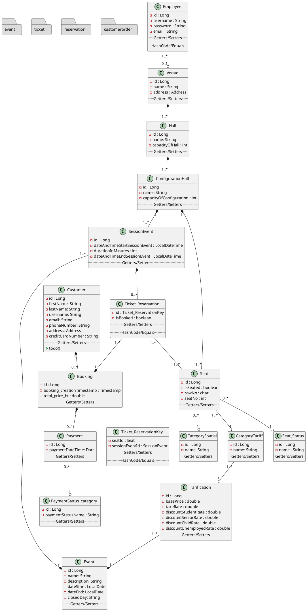

# UML DIAGRAM

```plantuml
@startuml
class Customer {
    - id : Long
    - firstName: String
    - lastName: String
    - username: String
    - email: String
    - phoneNumber: String
    - address: Address
    - creditCardNumber : String
    .. Getters/Setters ..
    + todo()
  }
  class Employee {
    - id : Long
    - username : String
    - password : String
    -email : String
    .. Getters/Setters ..
    .. HashCode/Equals ..
  }
class Booking {
    - id : Long
    - booking_creationTimestamp : Timestamp
    - total_price_ht : double
    .. Getters/Setters ..
}
 class CategorySpatial {
    - id : Long
    - name: String
    .. Getters/Setters ..
}
class CategoryTariff {
    - id : Long
    - name: String
    .. Getters/Setters ..
}
class ConfigurationHall {
    - id : Long
    - name: String
    - capacityOfConfiguration : int
    .. Getters/Setters ..
}
class Event {
    - id : Long
    - name: String
    - description: String
    - dateStart: LocalDate
    - dateEnd: LocalDate
    - closedDay: String
    .. Getters/Setters ..
}
class Hall {
    - id : Long
    - name: String
    - capacityOfHall : int
    .. Getters/Setters ..
}
class Payment {
    - id : Long
    - paymentDateTime: Date
    .. Getters/Setters ..
}
class PaymentStatus_category {
    - id : Long
    - paymentStatusName : String
    .. Getters/Setters ..
}
class Seat_Status {
    - id : Long
    - name : String
    .. Getters/Setters ..
}
class Seat {
    - id : Long
    - isSeated : boolean
    - rowNo : char
    - seatNo : int
    .. Getters/Setters ..
}
class SessionEvent {
    - id : Long
    - dateAndTimeStartSessionEvent : LocalDateTime
    - durationInMinutes : int
    - dateAndTimeEndSessionEvent : LocalDateTime
    .. Getters/Setters ..
}
class Tarification {
    - id : Long
    - basePrice : double
    - taxeRate : double
    - discountStudentRate : double
    - discountSeniorRate : double
    - discountChildRate : double
    - discountUnemployedRate : double
    .. Getters/Setters ..
}
class Ticket_Reservation {
    - id : Ticket_ReservationKey
    - isBooked : boolean
    .. Getters/Setters ..
    .. HashCode/Equals ..
}
class Ticket_ReservationKey {
    - seatId : Seat
    - sessionEventId : SessionEvent
    .. Getters/Setters ..
    .. HashCode/Equals ..
}
class Venue {
    - id : Long
    - name : String
    - address : Address
    .. Getters/Setters ..
}

package event <<Folder>> #DDDDDD{
Employee "1..*" --o "0..1" Venue
Venue "1" *-- "1..*" Hall
Hall "1" *-- "1..*" ConfigurationHall
ConfigurationHall "1" *-- "1..*" SessionEvent
SessionEvent "1..*" --* "1" Event
SessionEvent "1" *-- "0..*" Ticket_Reservation
}
package ticket <<Folder>> #DDDDDD{
ConfigurationHall "1" *-- "1..*" Seat
Seat "0..*" --o "1" Seat_Status
Seat "0..*" --o "1" CategorySpatial
Seat "1..*" --o "1" CategoryTariff
CategoryTariff "1..*" --o "1" Tarification
Tarification "1..*" --* "1" Event
}
package reservation <<Folder>> #DDDDDD{
Ticket_Reservation "1..*" --* "1" Booking
Ticket_Reservation --- Ticket_ReservationKey
Ticket_Reservation "1..*" -- "1..*" Seat
}
package customerorder <<Folder>> #DDDDDD{
Customer "1" *-- "0..*" Booking
Booking "1" *-- "0..1" Payment
Payment "0..*" --o "1" PaymentStatus_category
}

@enduml
```
